# Rancher网络探讨和扁平网络实现#

Rancher 1.2之后的版本在很多地方都有更新，容器网络方面除提供IPsec支持之外Rancher增加了对VXLAN支持，同时提供CNI插件管理机制，让用户可以hacking接入其他第三方CNI插件。

本文的主要内容有：

1. 什么是CNI接口
2. 容器网络基于CNI的实现---IPsec及VXLAN
3. 容器网络基于CNI的实现---直接路由访问容器
4. 容器网络介绍

## 1.1 容器的网络类型##

### 1.1.1 原始容器网络###

- Bridge模式
- HOST模式
- Container模式

### 1.1.2 容器网络的进化###

- Container Networking Model (CNM) 
- Container Networking Interface (CNI)

## 1.2  CNI和CNM简介 ##

CNM和CNI并不是网络实现而是网络规范和网络体系，CNM和CNI关心的是网络管理的问题。

 这两个模型全都是插件化的，用户可以以插件的形式去插入具体的网络实现。其中CNM由Docker公司自己提出，而CNI则是Google 的Kubernetes主导。总体上说CNM比较不灵活，也不难么开放，但是确是Docker的原生网络实现。而CNI则更具通用性，而且也十分的灵活。目前主流的插件如：Calico、Weave、Mesos基本上是对CNI和CNM两种规范都提供支持。

### 1.2.1 CNM接口：###

CNM是一个被 Docker 提出的规范。现在已经被Cisco Contiv, Kuryr, Open Virtual Networking (OVN), Project Calico, VMware 和 Weave 这些公司和项目所采纳。

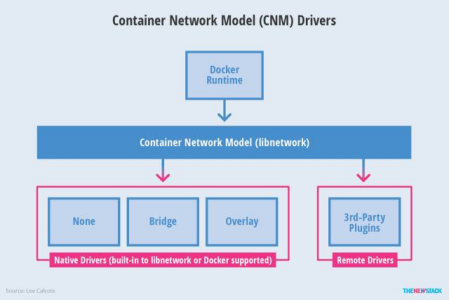

其中Libnetwork是CNM的原生实现。它为Docker daemon和网络驱动程序之间提供了接口。网络控制器负责将驱动和一个网络进行对接。每个驱动程序负责管理它所拥有的网络以及为该网络提供的各种服务，例如IPAM等等。由多个驱动支撑的多个网络可以同时并存。网络驱动可以按提供方被划分为原生驱动(libnetwork内置的或Docker支持的)或者远程驱动 (第三方插件)。原生驱动包括 none, bridge, overlay 以及 MACvlan。驱动也可以被按照适用范围被划分为本地（单主机）的和全局的 (多主机)。

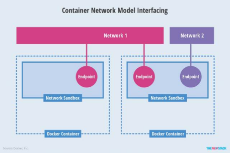

Network Sandbox：容器内部的网络栈，包含interface、路由表以及DNS等配置，可以看做基于容器网络配置的一个隔离环境（其概念类似“network namespace”）

Endpoint：网络接口，一端在网络容器内，另一端在网络内。一个Endpoints可以加入一个网络。一个容器可以有多个endpoints。

Network：一个endpoints的集合。该集合内的所有endpoints可以互联互通。（其概念类似：Linux bridge、VLAN）

最后，CNM还支持标签(labels)。Lable是以key-value对定义的元数据。用户可以通过定义label这样的元数据来自定义libnetwork和驱动的行为。

### 1.2.2  CNI网络接口

CNI是由Google提出的一个容器网络规范。已采纳改规范的包括Apache Mesos, Cloud Foundry, Kubernetes, Kurma 和 rkt。另外 Contiv Networking, Project Calico 和 Weave这些项目也为CNI提供插件。

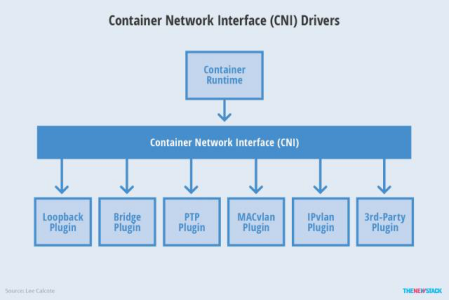

CNI 的规范比较小巧。它规定了一个容器runtime和网络插件之间的简单的契约。这个契约通过JSON的语法定义了CNI插件所需要提供的输入和输出。

一个容器可以被加入到被不同插件所驱动的多个网络之中。一个网络有自己对应的插件和唯一的名称。CNI 插件需要提供两个命令：一个用来将网络接口加入到指定网络，另一个用来将其移除。这两个接口分别在容器被创建和销毁的时候被调用。

在使用CNI接口时容器runtime首先需要分配一个网络命名空间以及一个容器ID。然后连同一些CNI配置参数传给网络驱动。接着网络驱动会将该容器连接到网络并将分配的IP地址以JSON的格式返回给容器runtime。

Mesos 是最新的加入CNI支持的项目。Cloud Foundry的支持也正在开发中。当前的Mesos网络使用宿主机模式，也就是说容器共享了宿主机的IP地址。Mesos正在尝试为每个容器提供一个自己的IP地址。这样做的目的是使得IT人员可以自行选择适合自己的组网方式。

目前，CNI的功能涵盖了IPAM, L2 和 L3。端口映射(L4)则由容器runtime自己负责。CNI也没有规定端口映射的规则。这样比较简化的设计对于Mesos来讲有些问题。端口映射是其中之一。另外一个问题是：当CNI的配置被改变时，容器的行为在规范中是没有定义的。为此，Mesos在CNI agent重启的时候，会使用该容器与CNI关联的配置。

## 2.Rancher的Overlay网络实现 ##

容器网络是容器云平台中很重要的一环，对于不同的规模、不同的安全要求，会有不同的选型。Rancher的默认网络改造成了CNI标准，同时也会支持其他第三方CNI插件，结合Rancher独有的Environment Template功能，用户可以在一个大集群中的每个隔离环境内，创建不同的网络模式，以满足各种业务场景需求，这种管理的灵活性是其他平台没有的。

至于Rancher为什么会选择CNI标准，最开始Rancher也是基于CNM进行了开发，但随着开发的深入，我们不得不转向了CNI，个中原因在本次交流中我们就不做详细说（tu）明（cao）了，大家如果有兴趣可以参阅：[http://blog.kubernetes.io/2016/01/why-Kubernetes-doesnt-use-libnetwork.html](http://blog.kubernetes.io/2016/01/why-Kubernetes-doesnt-use-libnetwork.html)

在之前的Rancher版本上，用户时常抱怨Rancher的网络只有IPsec，没有其他选择。而容器社区的发展是十分迅猛的，各种容器网络插件风起云涌。在Rancher v1.2之后Rancher 全面支持了CNI标准，除在容器网络中实现IPsec之外又实现了呼声比较高的VXLAN网络，同时增加了CNI插件管理机制，让用户可以hacking接入其他第三方CNI插件。随后将和大家一起解读一下Rancher网络的实现。

## 2.1  Rancher-net CNI的IPsec实现 ##

以最简单最快速方式部署Rancher并添加Host，以默认的IPsec网络部署一个简单的应用后，进入应用容器内部看一看网络情况，对比一下之前的Rancher版本：

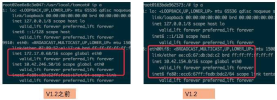

最直观的感受便是，网卡名从eth0到eth0@if8有了变化，原先网卡多IP的实现也去掉了，变成了单纯的IPsec网络IP。这其实就引来了我们要探讨的内容，虽然网络实现还是IPsec，但是rancher-net组件实际上是已经基于CNI标准了。最直接的证明就是看一下，rancher-net镜像的Dockerfile：

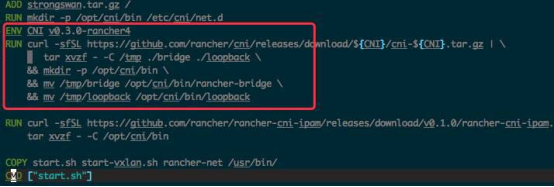

熟悉CNI规范的伙伴都知道/opt/cni/bin目录是CNI的插件目录，bridge和loopback也是CNI的默认插件，这里的rancher-bridge实际上和CNI原生的bridge没有太大差别，只是在幂等性健壮性上做了增强。而在IPAM也就是IP地址管理上，Rancher实现了一个自己的rancher-cni-ipam，它的实现非常简单，就是通过访问rancher-metadata来获取系统给容器分配的IP。Rancher实际上Fork了CNI的代码并做了这些修改，[https://github.com/rancher/cni](https://github.com/rancher/cni)。这样看来实际上，rancher-net的IPsec和Vxlan网络其实就是基于CNI的bridge基础上实现的。

在解释rancher-net怎么和CNI融合之前，我们需要了解一下CNI bridge模式是怎么工作的。举个例子，假设有两个容器nginx和mysql，每个容器都有自己的eth0，由于每个容器都是在各自的namespace里面，所以互相之间是无法通信的，这就需要在外部构建一个bridge来做二层转发，容器内的eth0和外部连接在容器上的虚拟网卡构建成对的veth设备，这样容器之间就可以通信了。其实无论是docker的bridge还是cni的bridge，这部分工作原理是差不多的，如图所示：

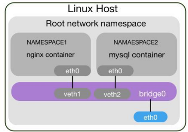

那么我们都知道CNI网络在创建时需要有一个配置，这个配置用来定义CNI网络模式，读取哪个CNI插件。在这个场景下也就是cni bridge的信息，这个信息rancher是通过rancher-compose传入metadata来控制的。查看ipsec服务的rancher-compose.yml可以看到，type使用rancher-bridge，ipam使用rancher-cni-ipam，bridge网桥则复用了docker0，有了这个配置我们甚至可以随意定义ipsec网络的CIDR，如下图所示：

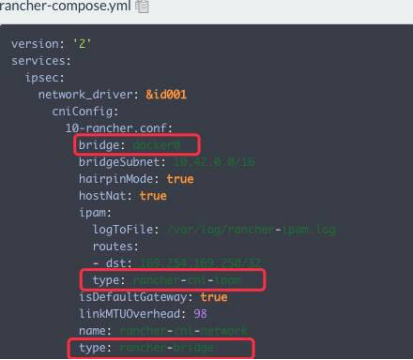

ipsec服务实际上有两个容器：一个是ipsec主容器，内部包含rancher-net服务和ipsec需要的charon服务；另一个sidekick容器是cni-driver，它来控制cni bridge的构建。两端主机通过IPsec隧道网络通信时，数据包到达物理网卡时，需要通过Host内的Iptables规则转发到ipsec容器内，这个Iptables规则管理则是由network-manager组件来完成的，[https://github.com/rancher/plugin-manager](https://github.com/rancher/plugin-manager)。其原理如下图所示（以IPsec为例）：

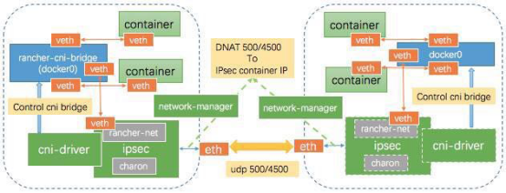

整体上看cni ipsec的实现比之前的ipsec精进了不少，而且也做了大量的解耦工作，不单纯是走向社区的标准，之前大量的Iptables规则也有了很大的减少，性能上其实也有了很大提升。

## 2.2  Rancher-net vxlan的实现 ##

那么rancher-net的另外一个backend vxlan又是如何实现的呢？我们需要创建一套VXLAN网络环境来一探究竟，默认的Cattle引擎网络是IPsec，如果修改成VXLAN有很多种方式，可以参考我下面使用的方式。

首先，创建一个新的Environment Template，把Rancher IPsec禁用，同时开启Rancher VXLAN，如下图所示：

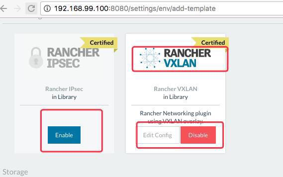

然后，我们创建一个新的ENV，并使用刚才创建的模版Cattle-VXLAN，创建完成后，添加Host即可使用。如下图所示：

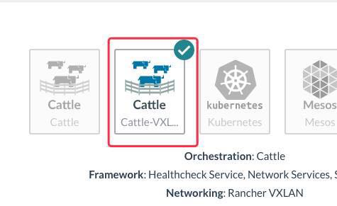

以分析IPsec网络实现方式来分析VXLAN，基本上会发现其原理大致相同。同样是基于CNI bridge，使用rancher提供的rancher-cni-bridge 、rancher-cni-ipam，网络配置信息以metadata方式注入。区别就在于rancher-net容器内部，rancher-net激活的是vxlan driver，它会生成一个vtep1042设备，并开启udp 4789端口，这个设备基于udp 4789构建vxlan overlay的两端通信，对于本机的容器通过eth0走bridge通信，对于其他Host的容器，则是通过路由规则转发到vtep1042设备上，再通过overlay到对端主机，由对端主机的bridge转发到相应的容器上。整个过程如图所示：

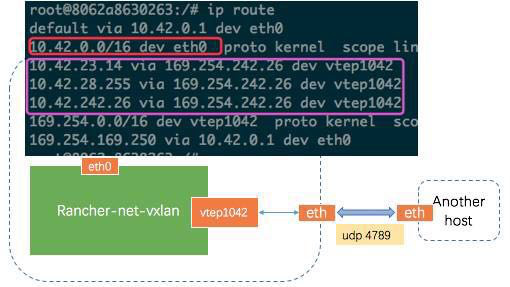

## 3.Rancher的扁平网络实现##

为什么需要扁平网络，因为容器目前主流的提供的都是Overlay网络，这个模式的好处是，灵活、容易部署、可以屏蔽网络对应用部署的阻碍，但是对很多用户而言，这样也带了了额外的网络开销，网络管理不可以控制，以及无法与现有SDN网络进行对接。

在实现扁平网络后，容器可以直接分配业务IP，这样访问容器上的应用就类似访问VM里的应用一样，可以直接通过路由直达，不需要进行NAT映射。但偏平网络带来的问题是，会消耗大量的业务段IP地址，同时网络广播也会增多。

## 3.1  扁平网络实现##

在Rancher环境中实现扁平网络需要使用自定义的bridge，同时这个bridge与docker0并没有直接关系。我们可以给容器添加新的网桥mybridge，并把容器通过veth对连接到网桥上mybridge上，如果要实现容器访问宿主机的VM上的服务可以将虚拟机配置的IP也配置到网桥上。进行如上配置后，容器就可以实现IP之间路由直接访问。此图中的vboxnet bridge可以看做是用户环境的上联交互机。

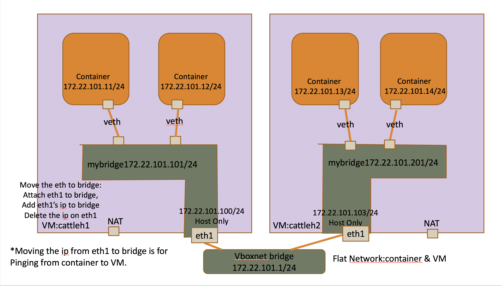

在VM和物理机的混合场景，所采用的方法也很类型，这边就再多做解释了。

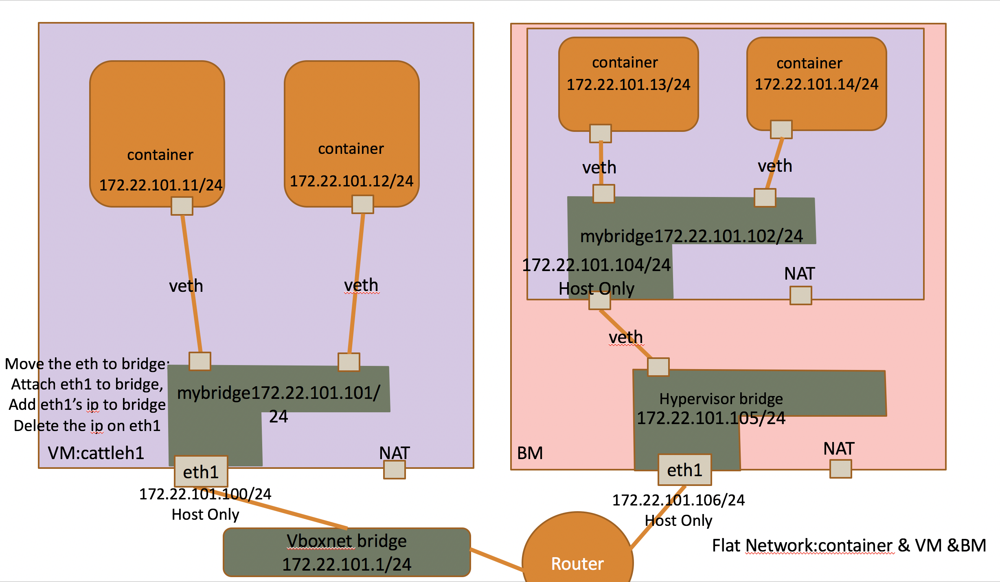

Rancher CNI网络环境实现扁平网络的工作流如下：

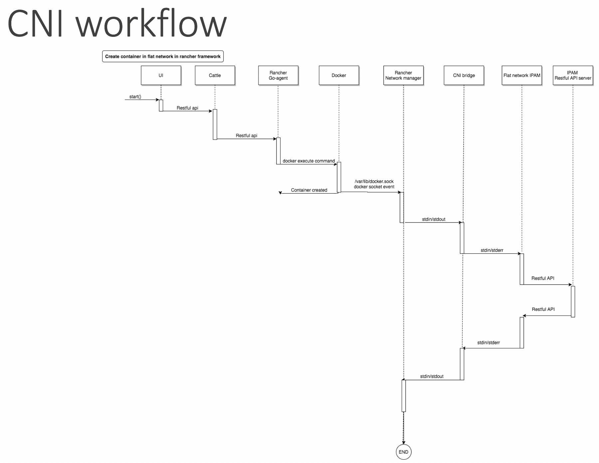

在实现容器扁平网络的基本配置后，就需要考虑和Rancher的集成，Rancher的Network-plugin的启动依赖于Metadata，而Metadata和DNS server均使用docker0的bridge网络（IP为[169.254.169.250](169.254.169.250)）。即，用户配置的扁平网络要能够访问到docker0网络，否则Rancher提供的服务发现与注册以及其它为业务层提供的服务将不可用。目前主要方法如下图所示：

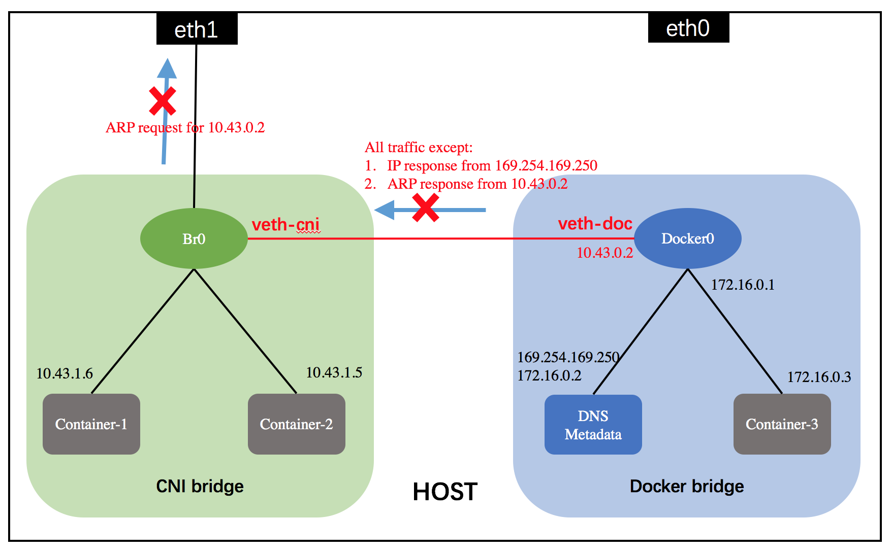

1. container-1内部有到达[169.254.169.250](169.254.169.250)的一条主机路由，即要访问[169.254.169.250](169.254.169.250)需要先访问[10.43.0.2](10.43.0.2)； 
2. 通过veth-cni与veth-doc的链接，CNI bridge下的container-1可以将ARP请求发送到docker0的[10.43.0.2](10.43.0.2)地址上。由于[10.1.0.2](10.1.0.2)的ARP response报文是被veth-cni放行的，于是container-1能够收到来自[10.43.0.2](10.43.0.2)的ARP response报文。
3. 然后container-1开始发送到[169.254.169.250](169.254.169.250)的IP请求，报文首先被送到docker0的veth-doc上，docker0查询路由表，将报文转到DNS/metadata对应的容器。然后IP报文原路返回，被docker0路由到veth1上往br0发送，由于来自[169.254.169.250](169.254.169.250)的IP报文都是被放行的，因此container-1最终能够收到IP。
4. 由于属于该network的所有的宿主机的docker0上都需要绑定IP地址[10.43.0.2](10.43.0.2)；因此，该IP地址必须被预留，即，在catalog中填写CNI的netconf配置时，不能将其放入IP地址池。
5. 同时，为了保障该地址对应的ARP请求报文不被发送出主机，从而收到其他主机上对应接口的ARP响应报文，需要对所有请求[10.1.0.2](10.1.0.2)地址的ARP REQUEST报文做限制，不允许其通过br0发送到宿主机网卡。

具体转发规则对应的ebtables规则如下所示：

Drop All traffic from veth-cni except:

1. IP response from [169.254.169.250](169.254.169.250)
2. ARP response from [10.43.0.2](10.43.0.2)

ebtables -t broute -A BROUTING -i veth-cni -j DROP

ebtables -t broute -I BROUTING -i veth-cni -p ipv4 --ip-source [169.254.169.250](169.254.169.250) -j ACCEPT

ebtables -t broute -I BROUTING -i veth-cni -p arp --arp-opcode 2 --arp-ip-src [10.43.0.2](10.43.0.2) -j ACCEPT 

Drop ARP request for [10.43.0.2](10.43.0.2) on eth1

ebtables -t nat -D POSTROUTING -p arp --arp-opcode 1 --arp-ip-dst [10.43.0.2](10.43.0.2)  -o eth1 -j DROP

另外也可以在容器所在的主机上将Docker0的bridge和CNI的bridge做三层打通，并使用iptables来进行控制，目前这个方式还在测试中。

 